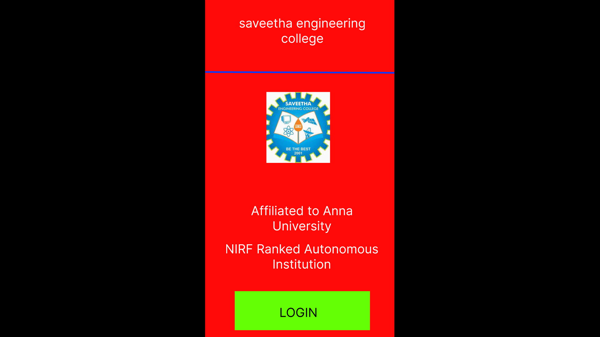
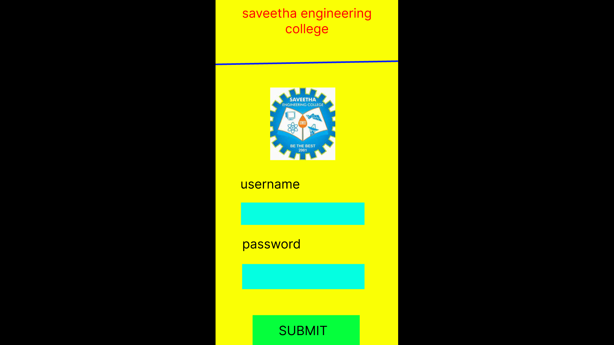
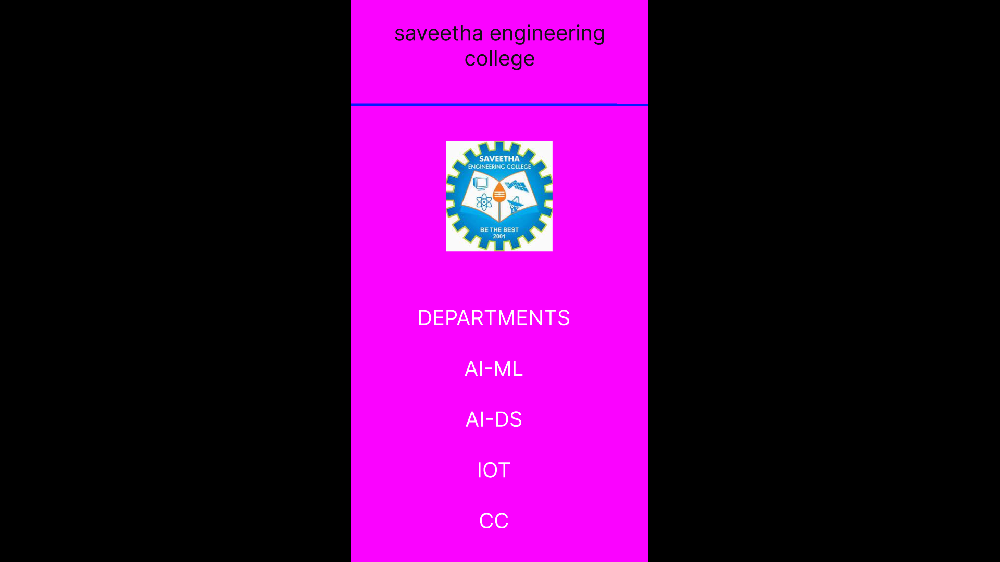

# Event Registration Web Application

## AIM:
To design, develop and deploy a web application for event registration.

## DESIGN STEPS:

### Step 1:
Create a new frame.

### Step 2:
Select any one preset size of your choice.

### Step 3:
Select the shapes you need.

### Step 4:
Import images as needed.

### Step 5:
Create pages based on your need and link them.

### Step 6:

Validate the HTML and CSS code.

### Step 6:

Publish the website in the given URL.

## DESIGN TOOL:
Figma

## code:
```
/* home page */
position: relative;
width: 485px;
height: 1154px;
background: #FF0909;

/* login page */
position: relative;
width: 457px;
height: 1142px;
background: #FAFF05;

/* saveetha engineering college */
position: absolute;
visibility: hidden;
width: 416px;
height: 100px;

font-family: 'Inter';
font-style: normal;
font-weight: 400;
font-size: 32px;
line-height: 39px;
text-align: center;
color: #FFFFFF;

/* Frame 1 */
position: absolute;
width: 416px;
height: 100px;
left: 21px;
top: 34px;

/* Line 3 */
position: absolute;
width: 457px;
height: 0px;
left: 0px;
top: 174px;
border: 4px solid #031CFF;

/* logo 1 */
position: absolute;
width: 163px;
height: 182px;
left: 147px;
top: 230px;
background: url(logo.jpg);

/* DEPARTMENTS AI-ML AI-DS IOT CC */

position: absolute;
width: 236px;
height: 351px;
left: 102px;
top: 499px;
font-family: 'Inter';
font-style: normal;
font-weight: 400;
font-size: 32px;
line-height: 39px;
text-align: center;
color: #FFFFFF;
```
## OUTPUT:




## RESULT:
The program to design, develop and deploy a web application for event registration is completed successfully.